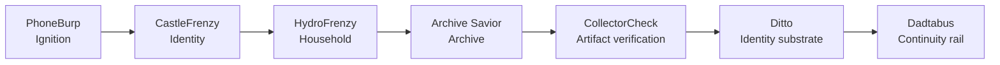

# Continuity Engine

## Overview

The Continuity Engine is a multi-layer continuity pipeline that turns everyday activity and artifacts into durable, connected continuity records. It moves records from household ignition through identity, household context, archival learning, and artifact verification, then carries them across the identity substrate to global continuity rails. The engine brings together module APIs, shared identity and provenance, scoring, persistence, and client applications so each stage can build on the prior record without losing its context.

## The Seven Modules



**PhoneBurp** starts the pipeline by ingesting receipts and other activity signals, triggering continuity rituals, and initializing records for downstream modules.

**CastleFrenzy** represents identity progression through castle rooms and symbolic continuity, linking new activity to a person's evolving identity.

**HydroFrenzy** adds household context through sticker scanning, bill continuity, dignity scoring, and community continuity.

**Archive Savior** provides the archivist layer: it teaches provenance and artifact lessons and supports future valuation of continuity records.

**CollectorCheck** maintains the artifact vault, provenance records, insurance continuity, and value comparisons used to verify and understand artifacts.

**Ditto** supplies the shared identity substrate, binding identities and transporting identity context across modules.

**Dadtabus** extends continuity to global rails through micropayments, continuity transport, and routing between systems.

## Continuity Record Flow

A record begins at **ignition**, where PhoneBurp captures an event or receipt. CastleFrenzy connects that activity to **identity**; HydroFrenzy enriches it with **household** context; and Archive Savior adds **archive** and provenance learning. CollectorCheck performs **artifact verification** and retains the related provenance and valuation context. Ditto carries the verified record through the shared **identity substrate**, and Dadtabus routes it onward to a **continuity rail**.

```text
Ignition -> Identity -> Household -> Archive -> Artifact verification
		 -> Identity substrate -> Continuity rail
```

Each handoff should preserve the record's relevant identity and provenance context so downstream modules can extend it without obscuring where it came from.

## Future Expansion

The pipeline is designed to grow by adding modules for new kinds of continuity while keeping shared record identity, provenance, and transport consistent. A new module should define its data model, protocol, API surface, scoring contribution where applicable, and integration points. Integrations can then be added to the engine's orchestration and routing layers without changing the responsibility boundaries of existing modules. See [the roadmap](docs/continuity-stack/ROADMAP.md) for planned evolution.

## Contributor Guide

Keep each module's responsibilities explicit and make its inputs, outputs, and continuity handoffs understandable to neighboring modules. For a full module implementation, follow the existing layout under `modules/<module>/`: put the module overview in `README.md`, the public contract in `api/spec.md`, and the model, core behavior, and controller in `engine/model.js`, `engine/core.js`, and `engine/controller.js`. Put engine runtime adapters in `continuity-engine/server/modules/` and module clients in `client/<module>/` when a user-facing client is needed. Keep shared architecture and contribution guidance in `docs/continuity-stack/`, and update the relevant specs and integration points whenever a record contract changes. Preserve provenance and identity context across module boundaries, and avoid duplicating shared responsibilities.

Start with [the architecture](docs/continuity-stack/ARCHITECTURE.md), [module documentation](docs/continuity-stack/MODULES.md), and [contribution guidelines](docs/continuity-stack/CONTRIBUTING.md).
