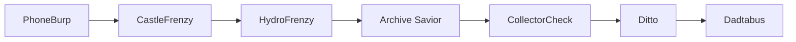

# Continuity Pipeline

The Continuity Pipeline carries one PhoneBurp receipt event through seven modules. `orchestrator.js` coordinates the handoffs in `moduleBinder.js`; `flowMap.js` describes the stages and their responsibilities.



PhoneBurp parses a receipt and awards BurpPoints. CastleFrenzy builds a continuity profile; HydroFrenzy records the household event and computes a dignity index. Archive Savior snapshots that state and captures provenance. CollectorCheck receives the artifact evidence, Ditto attaches it to an identity, and Dadtabus records a token and ledger credit.

CollectorCheck currently exposes only placeholder verification: `verified: false`. The pipeline preserves that status and does not claim an artifact has been verified. The pipeline uses in-memory objects; it does not persist pipeline runs or invoke the CollectorCheck HTTP service.

Run the full simulation from the repository root with `node pipeline/integrationHarness.js`. Run the integration tests with `node --test pipeline/pipelineTest.js`.

```js
const BurpEngine = require("../continuity-engine/phoneburp/burpEngine");
const Identity = require("../continuity-engine/ditto/identity");
const ContinuityOrchestrator = require("./orchestrator");

const pipeline = new ContinuityOrchestrator();
pipeline.bindIdentity(new Identity({ name: "Example Household" }));
const event = new BurpEngine().ingestReceipt({ merchant: "Corner Store", total: 24.75 });
const result = pipeline.runPipeline(event);
console.log(result.ledger, result.token);
```

`bindArtifact(artifact)` lets callers supply a CollectorCheck artifact before a run. `recordContinuity(event)` records a further Dadtabus token after an identity has been bound to the ledger by `runPipeline`.